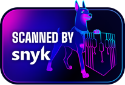

# @vanduo-oss/vd3

<a href="https://snyk.io/?utm_source=open-source&utm_medium=pg-ptr&utm_campaign=ref-2501-osp&utm_content=pg-cta"></a>

[](./LICENSE)

> Vanduo UI for Vue 3 — design system and component library.

Standalone [Vanduo](https://vanduo.dev) package: design tokens, CSS, and typed
`Vd*` components/composables. Sole peer: `vue >=3.3`. No pinia, no IIFE
runtime.

**Status: 1.7.5** — palette-derived accents, popover positioning/dismissal,
responsive Navbar/footer fixes, dock tint, optional gradient separators, and
bootstrap control over automatic theme persistence.

## Install

```sh
pnpm add @vanduo-oss/vd3
```

## Usage

Three integration points — import the stylesheet, register the plugin, and
render components:

```ts
// main.ts
import { createApp } from "vue";
import { VanduoVue } from "@vanduo-oss/vd3";
import "@vanduo-oss/vd3/css"; // full stylesheet (tokens + components + icons)
import App from "./App.vue";

createApp(App).use(VanduoVue).mount("#app");
```

`app.use(VanduoVue)` accepts optional `{ themeDefaults, storagePrefix }` —
`themeDefaults` overrides the generic baseline before the theme model first
reads it; `storagePrefix` remaps the six preference `localStorage` keys
(default `"vanduo-"`) so independently loaded sites on the same origin can use separate storage keys (e.g.
`app.use(VanduoVue, { themeDefaults: { PRIMARY_DARK: "blue" }, storagePrefix: "ts-school-" })`).

```vue
<script setup lang="ts">
import { VdButton, VdCard } from "@vanduo-oss/vd3";
</script>

<template>
  <VdCard>
    <VdButton variant="primary">Save</VdButton>
  </VdCard>
</template>
```

## Components & composables

Everything is a named export from the package root — import only what you
render; nothing registers globally.

- **63 components** — 56 `Vd*` components plus 7 layout primitives (`VdBox`,
  `VdCenter`, `VdCover`, `VdFrame`, `VdInline`, `VdStack`, `VdSwitcher`).
- **39 composable modules** — the theme API (`setThemeDefaults`, `useThemeBridge`, and the
  `useThemePreference` reactive singleton), plus form, overlay/dismissal,
  motion/scroll, and layout/interaction helpers. The `sanitizeHtml` whitelist
  sanitizer is exported too.

The full per-group inventory and the theming contract live in the agent/LLM
reference, [SKILL.md](./SKILL.md).

### Theming

The theme API (`applyPreference` and `useThemePreference`) drives six `data-*` attributes on `<html>` —
`data-palette`, `data-primary`, `data-neutral`, `data-radius`, `data-theme`,
`data-font` — which the CSS resolves into `--vd-*` custom properties (e.g.
`--vd-radius-scale`). Preferences persist to six `localStorage` keys under a
configurable prefix (default `vanduo-`): `vanduo-palette`,
`vanduo-primary-color`, `vanduo-neutral-color`, `vanduo-radius`,
`vanduo-theme-preference`, `vanduo-font-preference`. Pass
`storagePrefix: "app-"` (or call `setStoragePrefix`) at bootstrap to isolate
namespaces; no automatic migration between prefixes. Apps sharing the same module
instance still share theme state, defaults, and configuration.

`useThemePreference()` is a module-scope reactive singleton (no pinia) that is
the single source of truth behind `VdThemeSwitcher` and `VdThemeCustomizer`;
its setters route through `applyPreference` + `persistPreference`. Override the
default palette/primary/etc. via `app.use(VanduoVue, { themeDefaults })` or
`setThemeDefaults()`. Token data (`DEFAULTS`, `PALETTE_OPTIONS`, `tokens`, …) is
re-exported from the package root, or import raw JSON from
`@vanduo-oss/vd3/tokens.json`. Ship the stylesheet without bundled icon fonts with
`@vanduo-oss/vd3/css/core`.

Filled primary surfaces use `--vd-text-on-primary` (hover:
`--vd-text-on-primary-hover`). Status fills use `--vd-text-on-status`.
Override those on `<html>` for a custom primary that the built-in hue matrix
does not cover. `--vd-text-inverse` is the dark-surface token, not on-fill
ink. Light `.vd-btn-ink:hover` stays white on black.

Primary RGB helpers remain comma-separated for `rgba(var(--vd-color-primary-rgb), .25)`
and follow built-in hue, palette and theme changes. For custom CSS colors prefer
`color-mix(in srgb, var(--vd-color-primary) 25%, transparent)`; if overriding only
`--vd-color-primary`, also supply matching RGB channels for legacy RGB consumers.
The exported JSON is a flat resolved CSS-variable map, not a current DTCG interchange
schema. Format migration is outside this release's scope.

### SSR

The package is SSR / `vite-ssg`-safe: all browser access is client-guarded with
`typeof window` checks and `onMounted` / `onScopeDispose` lifecycle hooks, so
nothing touches `window`, `document`, `localStorage`, or `matchMedia` during
server render. `useThemePreference` seeds from defaults on the server and
hydrates from storage lazily on the first client call. Theme preferences and toast
queues are module-wide: static SSR shells are supported, but request-specific
mutations are not isolated. A storage prefix does not provide per-app/request state.

### Security

- **Open-source scanning** — this repo is monitored with
  [Snyk](https://snyk.io/?utm_source=open-source&utm_medium=pg-ptr&utm_campaign=ref-2501-osp&utm_content=pg-cta)
  (thanks for their support of open source).
- **Zero runtime dependencies** beyond the `vue >=3.3` peer — no pinia, no
  transitive runtime deps.
- **Hardened `.npmrc`:** `ignore-scripts`, `minimum-release-age`, `save-exact`,
  `strict-peer-dependencies`, `trust-policy=no-downgrade`,
  `block-exotic-subdeps`, and an explicit `registry`.
- **MIT** licensed ([LICENSE](./LICENSE)); bundled third-party notices in
  [THIRD-PARTY-LICENSES](./THIRD-PARTY-LICENSES) (Open Color, Phosphor Icons,
  and the adapted expanding-cards CSS — all MIT).

## Exports

| Export                        | Contents                                         |
| ----------------------------- | ------------------------------------------------ |
| `@vanduo-oss/vd3`             | Components, composables, theme API, token data   |
| `@vanduo-oss/vd3/highlight` | Optional `highlightCode` / `highlight` helpers |
| `@vanduo-oss/vd3/css`         | Full stylesheet (`dist/vd3.min.css`)             |
| `@vanduo-oss/vd3/css/core`    | Full stylesheet without icon fonts (`dist/vd3-core.min.css`) |
| `@vanduo-oss/vd3/tokens.json` | Resolved flat CSS-variable data (`dist/tokens.json`)    |

`./css/core` remains the full component stylesheet without icon fonts. A
true tokens-only CSS file and a core-only JS entry were evaluated and are
**not** shipped: adding them would overlap `./tokens.json` / named JS imports
and would redefine what consumers already treat as `/css/core`.

## Build pipeline

`pnpm build` runs the full chain, in order:

1. `scripts/clean-dist.mjs` — resets `dist/` (the only step that cleans;
   vite runs with `emptyOutDir: false`).
2. `scripts/build-tokens.mjs` — DTCG tokens (`tokens/`) → generated color
   partials (`css/core/generated/`, gitignored), the typed token-data module
   (`src/theme/generated/tokens.data.ts`, gitignored — inlined into the lib
   bundle) + `dist/tokens.json`. Zero-dependency and deterministic.
3. `scripts/build-css.mjs` — bundles `css/vd3.css` with lightningcss into
   `dist/vd3(.min).css` and the no-icons `dist/vd3-core(.min).css` (+ source
   maps), and copies `fonts/` and the Phosphor regular + fill icon weights
   into `dist/`.
4. `vite build` — the library and optional highlighter (`dist/{index,highlight}.{js,cjs}`).
5. `vue-tsc -p tsconfig.build.json` — the `.d.ts` declarations.
6. `scripts/check-class-coverage.mjs` — asserts every `vd-*` class the
   components render has a selector in `dist/vd3.min.css`
   (also standalone as `pnpm check:classes`).

`pnpm build:tokens` / `pnpm build:css` run steps 2–3 standalone;
`pnpm gen:fib` regenerates `tokens/primitive/color.fib.tokens.json`.

## Development

On a fresh clone, bootstrap the generated token-data module first — `src/`
imports `src/theme/generated/tokens.data.ts` (gitignored build output), so
lint/typecheck/test cannot pass until it exists:

```sh
pnpm install && pnpm build:tokens
```

Then the usual gates:

```sh
pnpm lint          # eslint
pnpm format:check  # prettier (src, tests, scripts)
pnpm stylelint     # authored css tree (generated partials excluded)
pnpm typecheck     # vue-tsc --noEmit
pnpm test:coverage # Vitest + type tests; full source, ratcheted coverage
pnpm build         # full chain including class coverage
pnpm test:skills   # published links, API inventory, typed recipes (after build)
pnpm test:size     # raw + gzip library artifact budgets
```

Consumers: Node >= 20.19. Contributors / CI: Node 24 and pnpm >= 10
(`packageManager: pnpm@10.28.2`). See [CONTRIBUTING.md](./CONTRIBUTING.md).

## Documentation

- [Component examples and guides](https://vd3.vanduo.dev/)
- Agent / LLM reference — [SKILL.md](./SKILL.md)
- Changelog — [CHANGELOG.md](./CHANGELOG.md)
- Contributing — [CONTRIBUTING.md](./CONTRIBUTING.md)

## License

[MIT](./LICENSE) © Vanduo

### Temporary theme controls

At bootstrap, `app.use(VanduoVue, { themePersistence: false })` disables the
shared theme singleton's automatic localStorage reads and writes. Controls still
share reactive state and apply preferences to the page. An app can explicitly
call `loadPreference()` and `persistPreference()` to own its saved choices.
The option defaults to `true`; call before creating theme consumers. Like
`storagePrefix`, it is module-global and does not isolate Vue apps or SSR requests.
Without the plugin, use `setThemePersistence(false)` at bootstrap.

Controlled customizer fans emit `update:primary` for previews/restores and
`select:primary` when a swatch is selected. Save only the latter when hover
previews must remain temporary.
